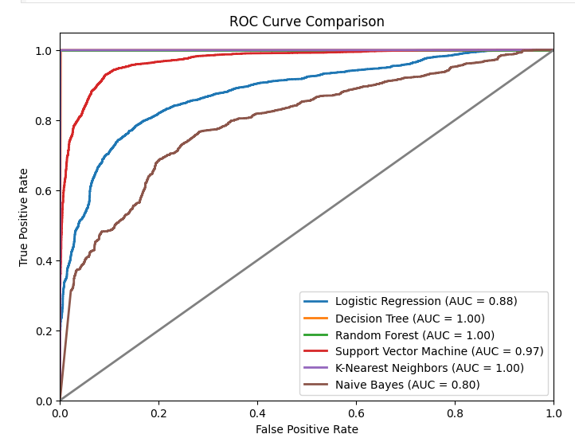
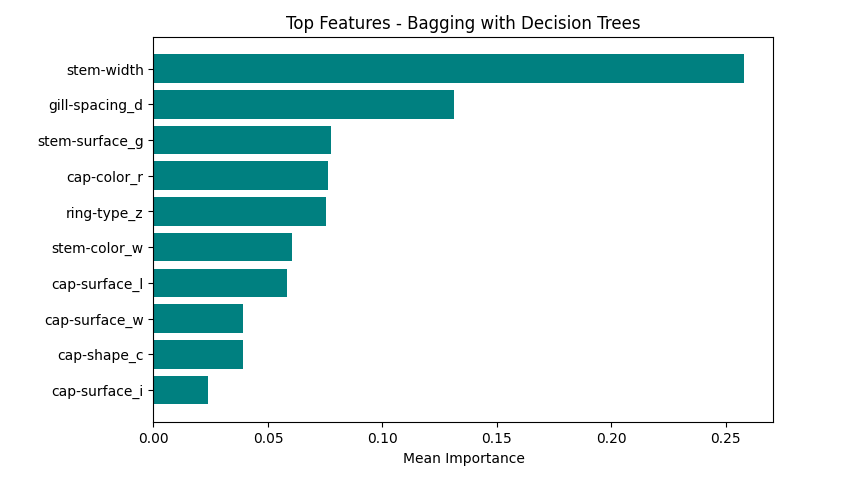

# 🍄 Mushroom Classification Project  

## 📌 Problem Description  
The goal of this project is to classify mushrooms as *edible (e)* or *poisonous (p)* based on *20 descriptive features* such as cap shape, cap color, stem characteristics, habitat, and season.  
This is a *binary classification problem*, where the target variable is the mushroom class.  

---

## ⚙ Project Workflow  

### 🔍 1. Exploratory Data Analysis (EDA)  
- Inspected dataset structure (rows, columns, data types).  
- Checked for *missing values* and *duplicates*.  
- Visualized categorical features (bar plots) and numerical features (histograms, boxplots).  
- Explored correlations between features and target class.  
- Checked *class imbalance* (edible vs poisonous).  

📊 *Class Distribution Example*  
| Distribution | Edible | Poisonous |
|--------------|--------|-----------|
| Before SMOTE | 21,745 | 26,993    |
| After SMOTE  | 26,993 | 26,993    |

---

### 🧹 2. Data Cleaning & Preprocessing  
- Handled missing/unknown entries.  
- Encoded categorical features using *Label Encoding / One-Hot Encoding*.  
- Scaled numerical features with *StandardScaler / MinMaxScaler*.  
- Applied *Stratified Train-Test Split* to preserve class balance.  
- Used *SMOTE* to resolve class imbalance.  

---

### 🧠 3. Feature Selection  
- *Filter Methods*: Chi-Square, ANOVA F-test, Mutual Information.  
- *Wrapper Methods*: Recursive Feature Elimination (RFE).  
- *Embedded Methods*: Feature importance from Decision Tree & Random Forest.  

✅ Selected key features:  
['stem-width', 'cap-diameter', 'ring-type_z', 'stem-surface_g', 'gill-attachment_p', ...]  

---

### 🤖 4. Model Training & Evaluation  
Trained the following classification models:  
- Logistic Regression  
- Decision Tree  
- Random Forest  
- Support Vector Machine (SVM)  
- K-Nearest Neighbors (KNN)  
- Naive Bayes  

📈 *Evaluation Metrics:*  
- Accuracy  
- Precision  
- Recall  
- F1-score  
- Confusion Matrix  
- ROC-AUC Curves  
- Cross-validation  

---

### 🎯 5. Hyperparameter Tuning  
- Applied *Grid Search* & *Random Search* for parameter optimization.  
- Compared *baseline models vs tuned models*.  

---

### 🌟 6. Feature Importance  
- Extracted feature importance using Decision Tree & Random Forest.  
- Ranked most influential features for classification.  

---

## 📊 Model Comparison  

| Model               | Accuracy | Precision | Recall | F1-score | Notes |
|---------------------|----------|-----------|--------|----------|-------|
| Logistic Regression | 0.8100   | 0.8101    | 0.8138 | 0.8095   | Baseline |
| Decision Tree       | 0.9989   | 0.9990    | 0.9989 | 0.9989   | Excellent |
| Random Forest       | *0.9999* | *0.9999* | *0.9999* | *0.9999* | ✅ Best Model |
| SVM (RBF)           | 0.9068   | 0.9052    | 0.9092 | 0.9062   | Strong |
| KNN (k=3)           | 0.9987   | 0.9987    | 0.9987 | 0.9987   | Strong |
| Naive Bayes         | 0.6398   | 0.7358    | 0.6705 | 0.6227   | Weak |

> *Best Performing Model:* ✅ *Random Forest* with *99.99% accuracy*  

---

## 📊 Visualizations  

### 🔹 ROC-AUC Curves  
ROC curves showing model performance across classifiers:  
  

---

### 🔹 Feature Importance  
Top features contributing to classification (Decision Tree / Random Forest):  
  

---

### 🔹 Confusion Matrices  
Confusion matrices for model comparison:  
  

---

## 🚀 Key Results  
- Achieved *99.99% accuracy* using Random Forest.  
- Identified *stem width* & *cap diameter* as most predictive features.  
- Demonstrated effective *class balancing with SMOTE*.  
- Built a full ML pipeline: *EDA → Preprocessing → Feature Selection → Model Training → Evaluation → Deployment*.  

---

## 📂 Repository Structure
